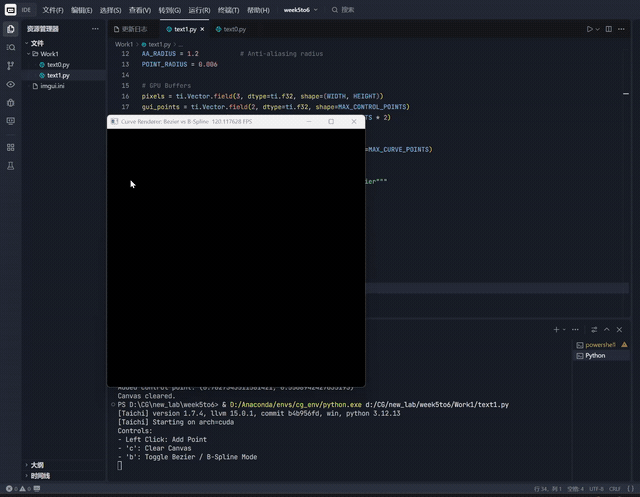
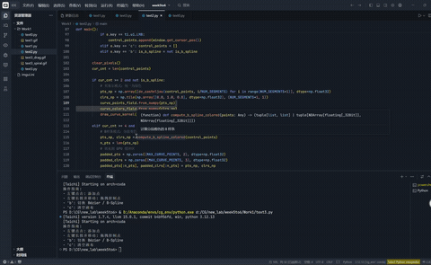
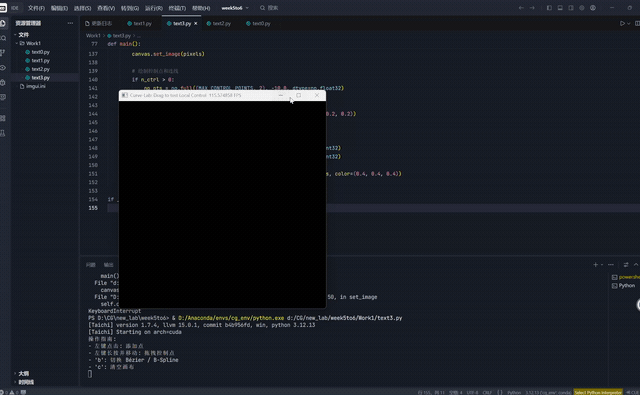
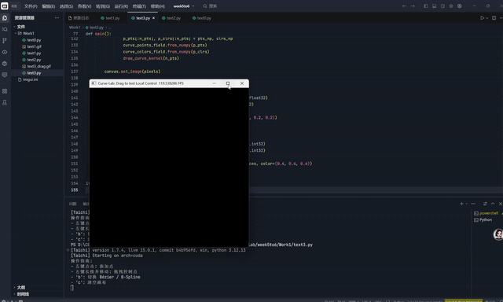
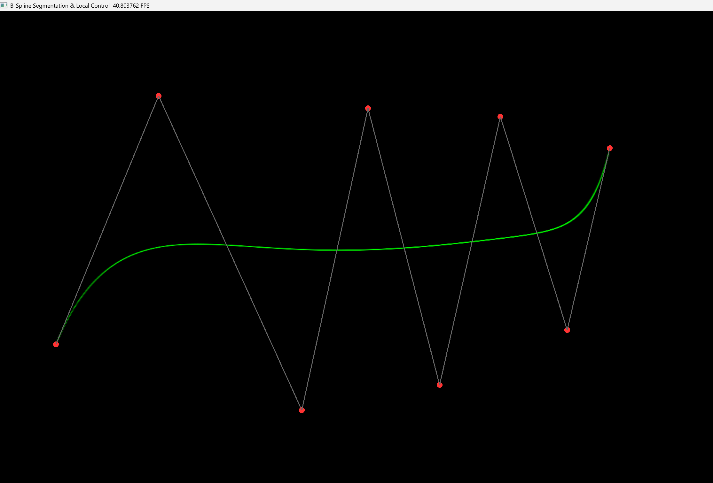
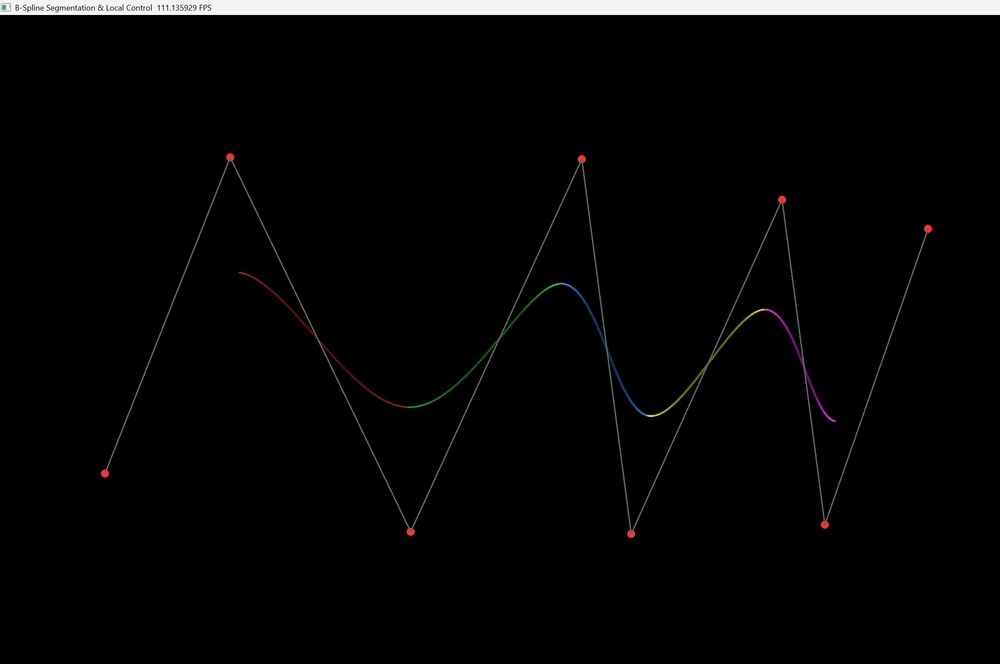

# 计算机图形学实验：Bézier 曲线与 B-Spline 的构建、交互及特性对比 (Taichi)

本项目是计算机图形学课程关于“曲线与曲面”的专题实验。基于面向数据的并行编程框架 **Taichi**，从底层算法出发，实现了 Bézier 曲线与均匀三次 B 样条（B-Spline）的实时渲染。项目重点探讨了 GPU 端的反走样（Anti-Aliasing）渲染、分段着色逻辑以及基于状态机的动态拖拽交互，直观地验证了曲线的局部控制性与连续性。

-----

## 📂 项目目录结构

本项目记录了从基础算法实现到交互系统优化的完整演进过程：

```text
Curve-Lab/
├── text0.py              # 基础任务：De Casteljau 算法实现与 CPU-GPU 通信架构
├── text1.py              # 进阶任务：B 样条矩阵算法引入与 GPU 距离场反走样渲染
├── text2.py              # 挑战任务：B 样条分段着色逻辑，可视化局部支撑性
├── text3.py              # 终极任务：交互式动态实验室！支持控制点实时拖拽修改
├── text1.gif             # text1 基础功能与模式切换演示
├── text1vstext3.gif      # 静态点击与动态拖拽的交互进化对比
├── text3_drag.gif        # 核心演示：拖拽控制点验证 B 样条的“局部控制”特性
├── text3_spiral.gif      # 极限测试：贝塞尔与 B 样条在绘制螺旋曲线时的表现差异
├── start_end_diff.png    # 静态对比：两种曲线在端点插值（是否穿过端点）的差异
└── README.md             # 本实验说明文档
```

-----

## 🎯 实验目标

  - **算法底层推导**：独立实现 Bézier 曲线的递归 De Casteljau 算法及 B 样条的矩阵基函数表示。
  - **掌握局部控制性**：通过分段着色与实时交互，验证 B 样条“牵一发而不动全身”的局部支撑性（Local Support）。
  - **GPU 并行优化**：利用 Taichi 的 `ti.kernel` 实现高效的反走样渲染，理解 `Field` 与 `Numpy` 的高速数据交换。
  - **交互系统设计**：设计并实现基于鼠标抓取算法的“拖拽”逻辑，模拟工业级 CAD 软件的交互体验。

-----

## 📐 数学原理总结

### 1\. Bézier 曲线 (De Casteljau 算法)

贝塞尔曲线的每个点 $P(t)$ 是通过控制点之间的线性插值递归得出的。其核心公式为：

$$P_i^k = (1 - t)P_i^{k-1} + tP_{i+1}^{k-1}$$

该算法具有**全局控制性**：改变任何一个控制点的位置，都会导致整条曲线的形状发生重新计算。
### 2. 均匀三次 B 样条 (B-Spline)

为了解决全局控制的局限，B 样条将曲线分段处理。每一段由 4 个相邻控制点决定，其矩阵表达形式为：

$$
P(t) = \frac{1}{6} 
\begin{pmatrix} t^3 & t^2 & t & 1 \end{pmatrix} 
\begin{pmatrix} 
-1 & 3 & -3 & 1 \\ 
3 & -6 & 3 & 0 \\ 
-3 & 0 & 3 & 0 \\ 
1 & 4 & 1 & 0 
\end{pmatrix} 
\begin{pmatrix} P_i \\ P_{i+1} \\ P_{i+2} \\ P_{i+3} \end{pmatrix}
$$

这种表示方法保证了拼接点处的 $C^2$ 连续（曲率连续），使得曲线视觉效果极其圆滑。

-----

## 🚀 项目迭代与功能演示

### 1\. 基础构建与 GPU 加速 (`text0` & `text1`)

  - **功能描述**：实现了从控制点输入到曲线生成的完整链路。`text1` 阶段引入了 GPU 端的距离场抗锯齿算法，利用 `ti.math.sqrt` 计算像素中心到几何位置的距离，消除了曲线的毛刺感。
  - **效果演示**：

### 2\. 交互进化：动态拖拽系统 (`text1` vs `text3`)

  - **功能描述**：从简单的“点击生成”进化到“实时抓取”。通过维护 `is_dragging` 状态机，系统可以实时识别鼠标与控制点的距离，并在每一帧同步更新数据。这使得用户可以“玩”曲线，直观感受几何形变。
  - **效果演示**：

### 3\. 核心特性：局部控制验证 (`text3_drag`)

  - **验证逻辑**：在 B-Spline 模式下，系统将每段曲线渲染为不同颜色。通过拖拽一个控制点，可以清晰地观察到**只有相邻的 4 段彩色曲线在移动**，其余部分（如远端的红色线段）完全静止。
  - **效果演示**：

### 4\. 深度对比：螺旋线测试与端点差异 (`text3_spiral`)

  - **特性差异**：
      - **螺旋线测试**：由于贝塞尔曲线具有向中心坍缩的倾向，在绘制复杂螺旋时会失去外轮廓；而 B 样条能更好地维持局部细节。
      - **端点插值**：贝塞尔曲线严格穿过首尾点，而 B 样条通常在控制多边形内部收缩。
  - **演示**：
  - **截图**：贝塞尔曲线严格穿过首尾点，而 B 样条却不一定，但是通常控制在多边形内部收缩
      - **贝塞尔曲线**：

      - **B样条**：



-----

## 🛠️ 环境依赖与运行说明

### 环境要求

  - **Python 3.8+**
  - **Taichi** (推荐版本 1.5.0+)
  - **Numpy**

### 运行

```bash
pip install taichi numpy
python text3.py
```

### 操作指南

| 按键 | 功能说明 |
| :--- | :--- |
| **鼠标左键 (点击)** | 添加一个新的控制点 |
| **鼠标左键 (长按拖拽)** | 选中并移动已有的控制点，观察局部形变 |
| **B 键** | 切换 Bézier / B-Spline 绘制模式 |
| **C 键** | 清空所有控制点，重置画布 |
| **Esc 键** | 安全退出程序 |

-----

> **实验总结**：通过本次实验，我不仅在数学上推导了参数曲线的表达，更在工程上通过 Taichi 框架体会到了高性能并行渲染的威力。动态交互逻辑的引入，使枯燥的几何公式变成了直观的视觉反馈。
