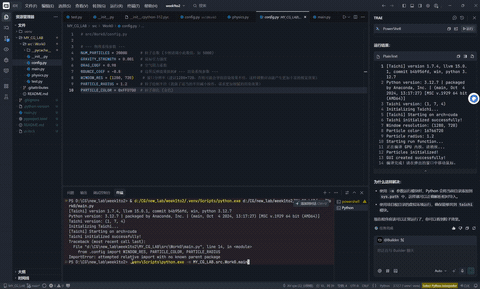

## 学号：202411081031   姓名：胥佳维   专业：计算机科学与技术
#  Taichi Gravity Swarm: 万有引力粒子集群模拟
> **实验项目 0**：基于 Taichi Lang 的高性能 GPU 粒子动力学模拟。
> 本项目在基础实验框架上进行了深度改进，通过优化粒子半径、色彩空间及物理参数，实现了在大规模粒子（20,000+）下的细腻渲染效果。
---
## 效果展示
> **实时动态演示**：以下是 20,000 个粒子在鼠标引力下的运动状态。
<p align="center">
  
</p>
---
## 核心改进与特性
相比于基础版本，本项目进行了以下优化：
a. **海量的粒子支持**：利用 Taichi 的 GPU 并行计算能力，在保持 60+ FPS 的前提下，支持 **20,000** 个粒子实时模拟。
b. **细腻的渲染表现**：
    * **精致半径**：将 `PARTICLE_RADIUS` 优化至 `1.2`，减少了色块感，增强了星云般的流动感。
    * **金色粒子流**：采用 `0xFFD700` (Gold) 配色，在深色背景下极具视觉冲击力。
*c. **物理动态平衡**：微调了 `DRAG_COEF` (阻力) 与 `BOUNCE_COEF` (弹性)，使粒子群在鼠标引力下呈现出更自然的"摆动"与"汇聚"效果。

---

## 实验收获与思考

这一节记录的是写完功能之后、对着窗口一遍遍拖动鼠标观察效果，反复调参数才得出的一些体会，很多结论在写代码之前是想不到的。

### 1. 粒子数量：先求"跑得动"，再求"好看"

一开始我并没有直接定 20,000 这个数字，而是从几百个粒子开始，确认引力、阻力、边界反弹这几块逻辑都正确之后，再一步步往上加。中间试过把 `NUM_PARTICLES` 拉到五万甚至更高，画面确实更"浓密"，但帧率掉得很明显，鼠标拖动时能感觉到明显的卡顿和延迟，粒子群跟手的感觉就没了。退回到 20,000 左右时，既能保持流畅的实时交互，星云状的密度感也基本够用，所以最终把这个数字定为默认值，同时在配置文件里专门留了注释提醒"卡顿请调小此数值"——这也是我自己踩过卡顿的坑之后才想起来要给后面使用的人留个提示。

### 2. 引力强度 GRAVITY_STRENGTH：从"贴脸冲过去"到"温柔靠拢"

`GRAVITY_STRENGTH` 这个值我前前后后调了好几轮。取得比较大的时候（比如 0.01 量级），粒子会几乎瞬间冲向鼠标位置，群体运动看起来更像是"被吸过去贴在一起"，缺少过程感，而且配合现在的阻力系数还容易在鼠标附近来回剧烈震荡。调得太小（比如 0.0001 量级）又会显得粒子对鼠标"无动于衷"，引力存在感很弱。最后定在 `0.001` 这个量级，是因为这个强度下粒子会有一个明显的、带弧度的"靠拢过程"，既能看出受到引力牵引，又不会显得突兀生硬。

### 3. 阻力系数 DRAG_COEF：决定粒子群是"活的"还是"死的"

这个参数对整体观感的影响比我预想的要大得多。`DRAG_COEF` 取接近 1.0（比如 0.999）时，粒子几乎不损失速度，鼠标松开/移开之后整个粒子群还会按照惯性持续晃荡很久，长时间运行下来甚至会出现轻微的"越积越乱"的感觉；而取得比较小（比如 0.9 以下）时，粒子一旦失去引力牵引几乎立刻停下来，画面会显得很僵硬、缺乏流动感，看起来不像"被拖拽"，更像是"被钉住"。试了几个中间值之后，`0.98` 是我觉得比较合适的折中：粒子在鼠标移动后还能保留一小段"滑动余韵"，但又不会无休止地晃下去，整体看起来比较接近流体或者烟雾那种自然的衰减感。

### 4. 边界反弹 BOUNCE_COEF：负得太狠会"粘墙"，负得太轻会"疯狂弹跳"

`BOUNCE_COEF` 一开始我直接想当然地设成了接近 -1.0（完全弹性碰撞），结果粒子撞到边界之后几乎不损失能量，配合密集的粒子数量，画面边缘会出现持续不断、很吵闹的来回弹跳，视觉上很不舒服。后来往 -0.5 附近调，又发现能量损失太多，粒子撞墙之后基本就贴在边界上不怎么动了，整个画面看起来"边框很脏"。最终选在 `-0.8`，是想要那种"撞上去会反弹回来，但每次反弹幅度都在自然衰减"的效果，这样粒子在边界附近最终会逐渐"沉淀"下来，而不是一直乱跳或者死死贴边。

### 5. 渲染细节：半径、颜色与分辨率的相互影响

* **粒子半径**：最早用的半径更大一些，画面里能看出明显的一个个圆点叠在一起，"色块感"很重，不太像连续的星云。把 `PARTICLE_RADIUS` 降到 `1.2` 之后，密集区域的粒子开始有了过渡感，整体更接近流动的光带而不是一堆离散的点，但半径如果再继续往下调，又会出现粒子在稀疏区域几乎看不见、画面显得"空"的问题，所以 1.2 是在"颗粒感"和"可见度"之间找的一个平衡点。
* **颜色选择**：试过白色和偏蓝的冷色，在深色背景下虽然也能看清楚，但视觉冲击力一般，整体偏"科技感"而不是"星云感"。换成金色 `0xFFD700` 之后，尤其是粒子聚集、亮度叠加的区域，会自然呈现出一种发光的暖色调，跟深色背景对比更强烈，也更符合"引力汇聚"这个主题想传达的视觉感受。
* **窗口分辨率**：分辨率和粒子半径其实是耦合在一起的——同样的半径数值，在更高分辨率下相对画面会显得更小、更稀疏。调过几次分辨率之后发现 1280×720 配合 1.2 的半径，密度和清晰度比较均衡，所以在配置文件里也专门写了注释，提醒分辨率改动可能需要联动调整半径，否则视觉效果会打折扣。

### 6. 代码结构上的小思考

把项目拆成 `config.py`（参数）、`physics.py`（纯物理计算）、`main.py`（GUI 与主循环）三个文件，主要是调参数的过程中体会到的需求：前期反复试参数时，如果把数值散落在物理逻辑代码里，每次调整都要去翻整段 kernel 代码，很容易改错或者漏改；抽成独立的配置文件之后，所有需要试验的"魔法数字"都集中在一处，调参的效率明显提高了很多，这也是我在多次反复修改 `GRAVITY_STRENGTH`、`DRAG_COEF` 这些参数的过程中，逐渐意识到应该把它们单独拎出来的。

### 7. 总结

整体来看，这个实验里代码逻辑本身并不复杂，真正花时间的地方是把几个物理参数（引力、阻力、反弹系数）和几个渲染参数（半径、颜色、分辨率）反复组合试验，找到一组"看起来自然"的取值。很多次调整都是先朝一个方向调过头、观察到不自然的效果之后再往回调，才慢慢逼近现在这组默认参数，这个过程让我对"参数不是孤立的，而是相互牵制"这件事有了比较直观的体会。

---
## 环境要求
运行本项目需要安装 Python 以及 Taichi 物理引擎：
```bash
pip install taichi
```
