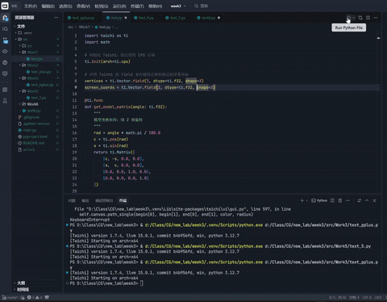
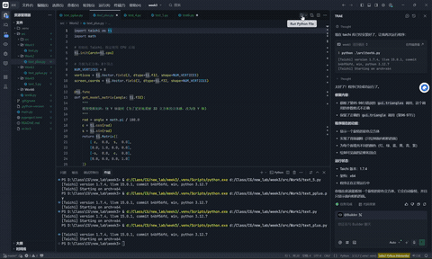
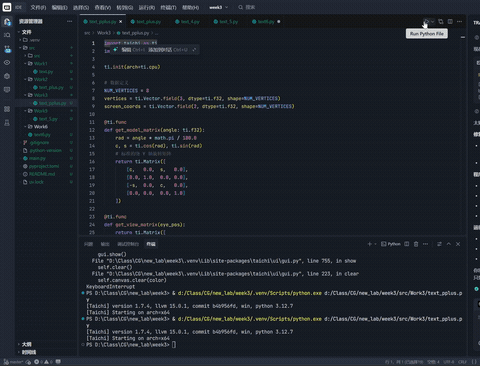
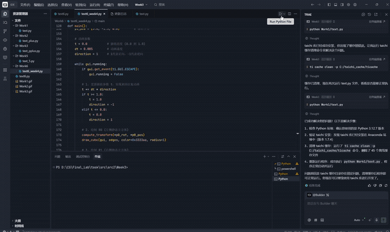

# 计算机图形学实验：3D 空间坐标变换与 MVP 矩阵实现 (Taichi)

本项目是计算机图形学课程的 **Week 3** 实验内容，基于面向数据的并行编程框架 **Taichi** 和 Python 实现。项目从零推导并构建了完整的模型变换 (Model)、视图变换 (View) 和投影变换 (Projection) 矩阵，成功将 3D 空间中的几何体渲染到 2D 屏幕上，并实现了流畅的实时交互。

-----

## 📂 项目目录结构

本项目严格遵循实验要求的层级结构进行组织，各部分功能明确：

```text
Week3/
├── Work1/                # 基础任务：三角形变换！
│   └── text.py           # 核心变换逻辑与 2D 三角形渲染
├── Work2/                # 选做任务：立方体线框渲染！
│   └── text_plus.py      # 3D 顶点与线框拓扑结构构建
├── Work3/                # 进阶任务：动态交互相机系统！
│   └── text_pplus.py     # 包含 FOV 与相机位移实时控制
├── Work5/                # 扩展实验资源包...待补充
├── Work6/                # 挑战任务：姿态插值与变换过渡 (New!)
│   └── text6_week4.py    # 实现 R0 到 R1 的旋转平移线性插值与轨迹动画
├── text6.py              # 附加功能与工具测试脚本
├── Work1.gif             # 基础任务效果演示
├── Work2.gif             # 立方体旋转演示
├── Work3.gif             # 动态相机交互演示
├── Work6.gif             # 姿态插值过渡演示 
└── README.md             # 项目说明文档
```

-----

## 🎯 实验目标

  - **深入理解管线**：完整掌握顶点从局部空间 (Local Space) 变换到屏幕空间 (Screen Space) 的数学流程。
  - **矩阵公式推导**：独立推导并用纯代码实现 `Model`、`View`、`Projection` $4 \times 4$ 齐次坐标变换矩阵。
  - **掌握并行框架**：学习 Taichi 的并行计算语法、`Field` 数据结构及矩阵运算优化。
  - **体会姿态插值与变换过渡**：在 3D 空间中定义两个不同的立方体姿态（起始姿态 $R_0$ 与终点姿态 $R_1$），通过参数 $t \in [0, 1]$ 实现两个姿态之间的平滑动画过渡。
-----

## 📐 MVP 变换推导与总结

顶点的最终屏幕位置是通过以下矩阵级联相乘得出的：
$$V_{screen} = M_{viewport} \cdot M_{projection} \cdot M_{view} \cdot M_{model} \cdot V_{local}$$

### 1\. 模型变换 (Model Transformation)

本实验主要实现绕轴旋转。以绕 Z 轴旋转 $\alpha$ 为例，其变换矩阵为：
$$M_{model(Z)} = \begin{pmatrix} 
\cos\alpha & -\sin\alpha & 0 & 0 \\ 
\sin\alpha & \cos\alpha & 0 & 0 \\ 
0 & 0 & 1 & 0 \\ 
0 & 0 & 0 & 1 
\end{pmatrix}$$
### 2\. 视图变换 (View Transformation)

视图变换将相机移动至原点，并使其看向 $-Z$ 方向。在本实验中，通过平移相机位置 $e(x, y, z)$ 的逆矩阵实现：
$$M_{view} = \begin{pmatrix} 
1 & 0 & 0 & -e_x \\ 
0 & 1 & 0 & -e_y \\ 
0 & 0 & 1 & -e_z \\ 
0 & 0 & 0 & 1 
\end{pmatrix}$$
### 3\. 透视投影变换 (Perspective Projection)

这是本项目最核心的数学部分，分为两个子步骤：

   **透视挤压 ($M_{persp \to ortho}$)**：利用相似三角形原理，将视锥平截头体挤压成长方体。其核心逻辑是保持 $z$ 轴上的近平面和远平面不变，同时将 $z$ 值映射到 $w$ 分量以便后续进行透视除法。
   **正交投影 ($M_{ortho}$)**：将长方体缩放并平移至标准设备坐标 (NDC) 的 $[-1, 1]^3$ 空间。

最终整合后的投影矩阵 $M_{proj}$ 考虑了视场角 ($fov$)、屏幕宽高比 ($aspect$) 及近远平面距离。

### 4\. 姿态插值过渡（Pose Interpolation）
**核心实现逻辑多维模型变换矩阵**:扩展了 get_model_matrix 函数，支持 X、Y、Z 三轴独立的旋转以及三维平移向量。
**线性插值 (Lerp)**：旋转插值：对三个轴的角度分别进行线性插值：$Angle_t = Angle_0 + t \cdot (Angle_1 - Angle_0)$。
**位移插值**：对空间坐标进行线性插值，使立方体在两点间直线移动。抛物线轨迹优化：为了增强视觉表现力，在位移插值的基础上引入了基于 $sin(t \cdot \pi)$ 的高度偏移，模拟立方体从起点“跃迁”到终点的动态效果。

**位置插值**：$P_t = (1 - t)P_0 + tP_1$
**旋转插值**：$Angle_t = (1 - t)Angle_0 + tAngle_1$

-----

## 🚀 项目结构与功能演示

### 1\. 基础任务：3D 三角形 MVP 变换 (`text.py`)

  - **功能描述**：在 3D 空间中定义了一个三角形（顶点包括 `(2.0, 0.0, -2.0)` 等），通过计算 MVP 矩阵将其变换为 2D 屏幕坐标。实现了透视平截头体到正交长方体的挤压矩阵转换，并支持绕 Z 轴旋转。
  - **效果演示**：
  

### 2\. 选做任务：3D 立体正方体构建与透视 (`text_plus.py`)

  - **功能描述**：将 2D 扁平三角形升级为真正的 3D 正方体。构建了 8 个顶点和 12 条边的几何拓扑结构，并将旋转轴修改为 Y 轴。通过透视投影矩阵，完美展现了 3D 立方体的空间透视感（近大远小）。
  - **效果演示**：
  

### 3\. 进阶拓展：交互式相机与 FOV 控制 (`text_pplus.py`)

  - **功能描述**：在完成标准要求的基础上，进一步丰富了用户交互。新增了对相机 Z 轴距离（视点远近）和视场角（FOV，Y 轴方向）的动态控制，可以通过键盘实时调整投影参数，更直观地观察透视投影矩阵中参数变化对最终渲染画面的影响。
  - **效果演示**：

### 3\. 挑战任务：姿态插值过渡 (Pose Interpolation Transition) (text6_week4.py)

- **功能描述**：实现了从起始姿态 $R_0$ 到目标姿态 $R_1$ 的全自动平滑动画切换。该模块不再局限于简单的单一轴旋转，而是通过定义两个独立的状态（包含各自的旋转角与空间位置），利用插值参数 $t \in [0, 1]$ 实时计算中间状态。
- **核心技术点**：线性插值 ：对 X/Y/Z 三轴欧拉角及位移向量进行线性混合，确保变换的连续性。轨迹算法优化：在位移插值基础上引入了基于 $sin(t \cdot \pi)$ 的高度偏移函数，模拟立方体在姿态切换时的“跃迁”弧度，增强了视觉引导效果。
- **多状态同屏渲染**：同时绘制静态参考姿态（暗色线框）与动态插值姿态（高亮线框），直观展示变换路径。通俗来说就是给不同状态的立方体不同颜色，保证良好的视觉效果。
- **效果演示**：

-----


## 🛠️ 环境依赖与运行说明

### 环境要求

  - **Python 3.x**
  - **Taichi** (指定使用 CPU 后端运行)

### 安装依赖

```bash
pip install taichi
```

### 运行操作指南

| 按键 | 功能说明 |
| :--- | :--- |
| **A / D** | 物体绕旋转轴顺时针 / 逆时针旋转 |
| **W / S** | 增大 / 减小视场角 (FOV) (仅 Work3) |
| **Q / E** | 相机沿 Z 轴推拉 (拉远 / 拉近) (仅 Work3) |
| **Esc** | 安全退出程序 |


