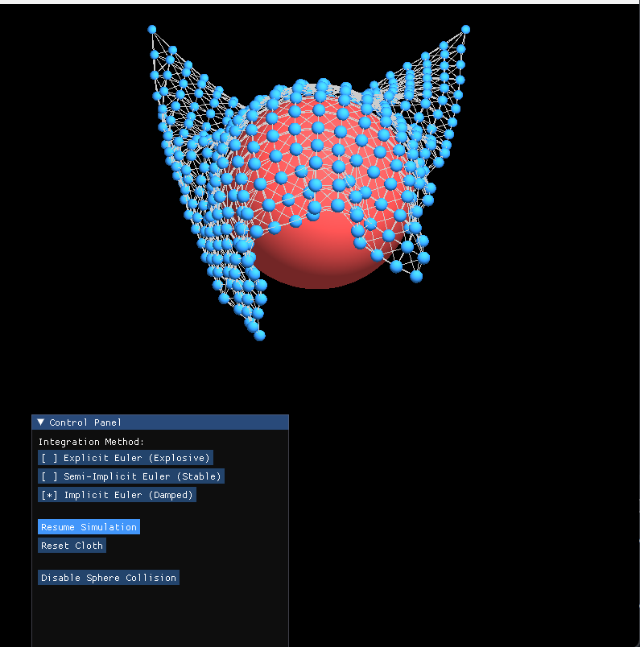
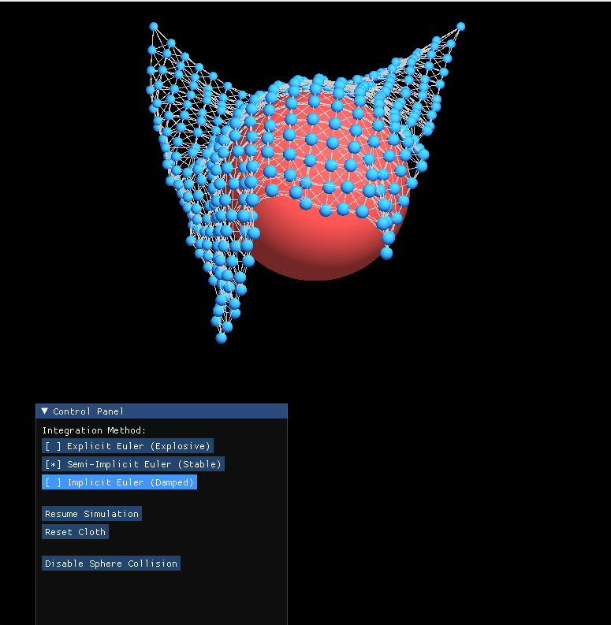
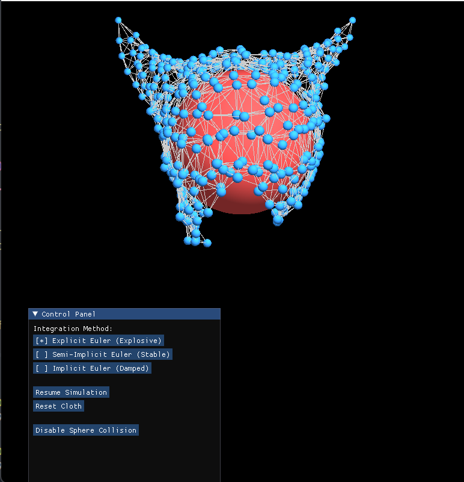
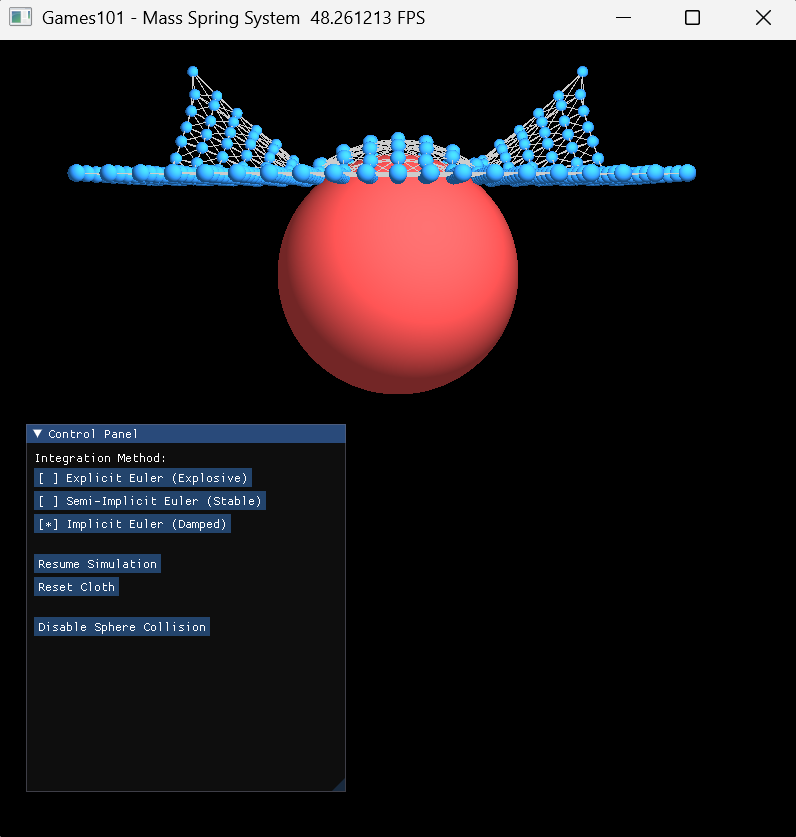
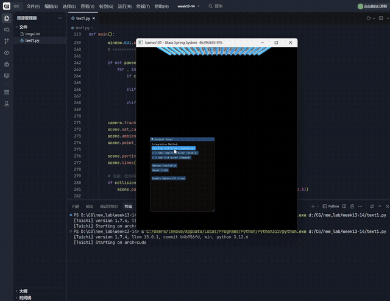

# 动态场景渲染实验：质点-弹簧布料模拟系统

基于 Taichi 框架实现的布料动力学模拟，对比三种数值积分方法在物理模拟中的稳定性差异，并在结构弹簧的基础上扩展实现了剪切弹簧、弯曲弹簧与球体碰撞。

## 实验完成情况

### 基础任务

- 场景初始化：将初始化拆分为 `init_positions`、`init_springs`、`init_spring_indices` 三个独立 kernel，由 Python 层按顺序调用，保证多线程下 GPU 状态写入的同步顺序，避免出现弹簧拓扑读取到未初始化位置的问题。
- 力学计算与防爆处理：将重力、阻尼、弹簧力的计算封装为 `ti.func`，编译期自动内联进调用它的 kernel；速度钳制 `clamp_velocity` 独立成另一个 `ti.func`，用于约束显式欧拉等不稳定方法下的数值发散。
- 三种数值积分器对比：分别实现显式欧拉、半隐式欧拉、隐式欧拉（三次定点迭代近似求解），并将受力计算与状态更新合并进同一个 kernel，每个物理子步只触发一次 kernel 启动。
- GGUI 交互面板：支持三种积分方法的实时切换、暂停/恢复、重置布料，切换积分方法时自动重置场景，避免从已发散的状态继续模拟导致误判稳定性。

### 选做任务（实际完成）

- 剪切弹簧（Shear Springs）：在每个网格小格的两条对角线方向新增弹簧，抵抗布料在平面内的剪切变形，避免格子被过度拉成平行四边形。
- 弯曲弹簧（Bending Springs）：跳过相邻质点连接次相邻点，抵抗布料的过度折叠，使整体形态更挺括，减少褶皱堆积。
- 球体碰撞处理：在场景中放置固定球体，每个物理子步后检测质点与球心的距离，若发生穿透则将质点投影回球面，并清除速度中指向球心的法向分量，保留切向分量实现沿球面的滑落效果。新增碰撞开关按钮，可在面板中实时启用/关闭。

## 演示效果

### 隐式欧拉：布料稳定包裹球体

隐式欧拉的强阻尼特性使布料在接触球体后迅速趋于稳定，紧密贴合球面，没有出现明显的抖动或穿透。



### 半隐式欧拉：自然下垂与贴合

半隐式欧拉在保持运动自然感的同时维持了较好的稳定性，可以看到布料下垂形成的褶皱比隐式欧拉更丰富，剪切弹簧和弯曲弹簧共同作用下边缘不再出现锐利的网格拉伸。



### 显式欧拉：数值发散的典型表现

在相同参数下显式欧拉已经出现明显的形变异常，质点间距被不均匀拉伸，边缘出现尖角状突起，直观验证了显式欧拉在该步长下条件稳定性差的结论。




### 碰撞触发前：布料下落过程

布料在重力作用下整体下落、尚未接触球体的中间状态，可以看到结构弹簧、剪切弹簧、弯曲弹簧共同维持着布料的整体形态，没有因为弯曲弹簧过强而显得僵硬。



### 整体演示视频



## 运行方式

```bash
conda create -n cg_env python=3.12 -y
conda activate cg_env
pip install taichi
python mass_spring_cloth.py
```

## 实验收获与突破尝试

在这次实验之前，我对基于物理的动画只停留在"弹簧力公式"层面的理解，这次实验让我真正搞清楚了一个布料模拟系统从数据组织到数值求解再到 GPU 并行的完整链路。

最直接的收获是对三种积分方法稳定性差异的实感认识。课本上"显式欧拉条件稳定、隐式欧拉无条件稳定"是一句抽象的话，但当我在相同的 `k_s`、`dt`、`k_d` 参数下连续切换三种方法、亲眼看着显式欧拉的布料边缘被拉扯成尖角而半隐式和隐式都保持平滑时，才理解了"稳定性"在物理模拟里具体意味着什么——不是数值偶尔出错，而是误差会随时间步累积放大成系统性的形变失真。这也让我对隐式欧拉为什么需要做定点迭代近似求解有了更具体的体会：因为它依赖未来时刻的力，本质上是一个隐式方程，定点迭代只是用有限次数的显式计算去逼近这个隐式解。

第二个收获在于 Taichi 的并行编程心智模型。一开始我习惯性地想把所有计算塞进一个大循环里，但任务要求拆分多个 kernel 来保证 GPU 同步，这逼着我去理解 Taichi 顶层 for 循环之间存在隐式同步屏障、而循环内部是完全并行无序执行的——这意味着弹簧初始化必须等位置初始化完全结束后才能开始，否则会读到未写入的脏数据。这个认知也直接体现在我后续扩展弹簧类型时：我没有给剪切弹簧和弯曲弹簧单独开 kernel，而是把它们都塞进同一个 `init_springs` 的并行循环体里，用 `ti.atomic_add` 保证弹簧计数器在多线程写入时不冲突，这样既满足了同步要求，又没有引入额外的 kernel 启动开销。

在选做内容上，我没有止步于"把对角线弹簧加上去"，而是认真考虑了三种弹簧之间的劲度系数应该如何配比。最初我把剪切弹簧和弯曲弹簧的 `k_s` 设得和结构弹簧一样大，结果布料看起来完全像一块硬纸板，失去了悬垂感；后来我意识到弯曲弹簧的作用应该是"抑制"而不是"主导"形变，于是把它调低到结构弹簧的四分之一左右，才得到了截图中那种既有挺括感又不失自然垂坠的效果。这个反复调参的过程让我对"力学参数的物理意义"有了比看公式更深的理解。

球体碰撞部分是我觉得最有挑战、也最有成就感的一块。最初的实现只是简单地把穿透质点的位置投影回球面，但没有处理速度，结果布料贴到球上之后会出现持续的高频抖动；排查之后才发现是因为质点的速度仍然带着指向球心的分量，下一帧又会重新撞进球体形成振荡。把这个法向速度分量清零、只保留切向速度之后，布料才真正实现了沿球面"滑落"的效果，而不是抖动着卡在球面附近。这个调试过程让我体会到碰撞响应不仅仅是几何上的位置修正，速度层面的处理同样关键，这也是图形学中"基于约束的物理模拟"思路的一个雏形。

整体来看，这次实验让我从"会写弹簧力公式"进阶到了"理解一个完整物理模拟系统的架构设计、数值稳定性来源、以及 GPU 并行编程的同步约束"，也是我第一次完整地把选做内容的物理直觉和实际调参经验结合起来完成。
