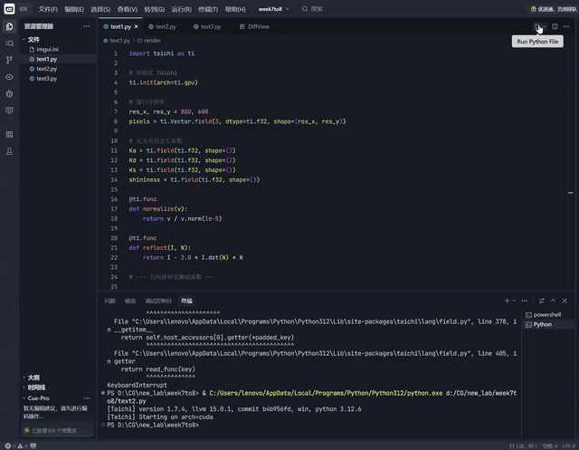
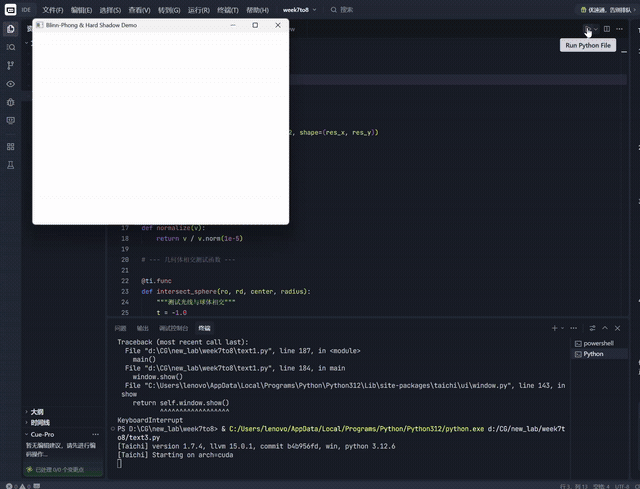

# 基于 Taichi 的交互式局部光照渲染器

## 学号：202411081031  姓名：胥佳维  专业：计算机科学与技术

本项目是计算机图形学课程实验作业。基于 **Taichi** 框架实现了两个版本的渲染器，分别展示了经典 **Phong** 模型与进阶 **Blinn-Phong + 阴影** 模型的视觉差异，并探讨了三维空间中的物体布局与遮挡关系。

---

## 一、 项目目录结构

```text
.
├── phong_no_occlusion.py    # 版本 A：Phong 模型 + 展开式无遮挡布局
├── blinn_phong_shadow.py    # 版本 B：Blinn-Phong 模型 + 硬阴影 + 深度遮挡布局
├── README.md                # 项目说明文档
└── .gitignore                # Git 忽略文件
```

---

## 二、 实验目标

1. **光照模型对比**：实现并对比经典 Phong 模型（基于反射向量）与 Blinn-Phong 模型（基于半程向量）的渲染效果。
2. **空间布局与深度测试**：通过调整物体坐标，验证 Z-buffer 深度竞争逻辑在处理物体遮挡（Occlusion）时的正确性。
3. **高级特性实现**：在 GPU 上实现基于阴影射线（Shadow Ray）的实时硬阴影检测。
4. **鲁棒性优化**：通过数学修正解决圆锥体底面"视觉倾斜"问题，并消除阴影算法中的自遮挡噪点（Shadow Acne）。

---

## 三、数学原理总结

### 1. 光照模型演进
* **Phong 模型 (Version A)**：
    使用反射向量 $\mathbf{R}$ 与视线向量 $\mathbf{V}$ 的夹角计算高光。
    $$I_{spec} = K_s (\mathbf{R} \cdot \mathbf{V})^n$$
* **Blinn-Phong 模型 (Version B)**：
    使用法线 $\mathbf{N}$ 与半程向量 $\mathbf{H}$ 的夹角计算。在大角度下比 Phong 模型更自然。
    $$\mathbf{H} = \frac{\mathbf{L} + \mathbf{V}}{\|\mathbf{L} + \mathbf{V}\|}, \quad I_{spec} = K_s (\mathbf{N} \cdot \mathbf{H})^n$$

### 2. 阴影射线 (Shadow Ray)
在物体表面点 $P$ 沿光源方向 $L$ 发射射线。若在距离 $dist(L)$ 内检测到交点，则该点处于阴影。
为防止浮点误差导致物体"自遮挡"，对起点进行微量偏移：
$$P_{start} = P + \mathbf{N} \times 10^{-3}$$

---

## 四、项目版本演示与关键代码

### 版本 A：Phong 基础版（源代码为 text1.py）
**特点**：采用等腰三角形分布，三个物体互不遮挡，便于观察单一物体的光照表现。

```python
# 版本 A 关键渲染逻辑：Phong 反射向量计算
R = normalize(reflect(-L, N))
spec = ti.max(0.0, R.dot(V)) ** shininess[None]
color = ambient + diffuse + specular
```
- **效果演示**：

### 版本 B：进阶阴影版（源代码为 text3.py）
**特点**：采用深度重叠布局，红色球体部分遮挡蓝色圆锥，开启硬阴影以增强空间层次感。

```python
# 版本 B 关键渲染逻辑：Blinn-Phong 半程向量 + 阴影检测
H_vec = normalize(L + V)
spec = ti.max(0.0, N.dot(H_vec)) ** shininess[None]

# 阴影射线求交 (以球体为例)
t_s, _ = intersect_sphere(shadow_ro, shadow_rd, sphere_center, radius)
if 0 < t_s < light_dist:
    color = ambient  # 处于阴影，仅保留环境光
```
- **效果演示**：

---

## 五、运行结果分析

| 特性 | 版本 A (Phong) | 版本 B (Blinn-Phong + Shadow) |
| :--- | :--- | :--- |
| **高光表现** | 高光斑点较小，在边缘处衰减较快 | 高光区域更自然，符合真实物理分布 |
| **物体布局** | **无遮挡**：红球(-2.0)、蓝锥(0.0)、紫锥(2.0) | **深度遮挡**：红球(-1.2)部分挡住蓝锥(0.0) |
| **深度验证** | 仅验证了单体渲染的正确性 | 成功验证了 Z-buffer 自动处理近距离遮挡的逻辑 |
| **空间感** | 较弱，物体像悬浮在背景上 | **强**，硬阴影清晰交待了物体间的相对位置 |

**圆锥底面修复说明**：
两个版本均集成了底面封盖逻辑。通过在求交函数中增加对 $y = base\_y$ 平面的判定，确保圆锥在任何视角下底部都呈现为水平圆面，解决了单纯使用侧面解析解产生的视觉畸变。

---

## 六、实验收获与思考

这一部分记录的是我在调试过程中真正花费时间、走过弯路的地方，而不是最终代码呈现出来的"理所当然"的样子。

### 1. 参数调节：从"数值正确"到"视觉舒适"

刚开始我以为 `Ka/Kd/Ks/shininess` 只是简单的权重叠加，调起来应该很直观，但实际动手拖动滑条之后才发现这几个量之间是相互牵制的：

- **Ka（环境光）**：一开始我把它设成 0.1 左右，结果阴影区域几乎是纯黑的，完全看不出物体在阴影里的形状轮廓，画面显得很"假"。后来反复试验发现 0.2 左右是一个比较合适的下限——既能让阴影区域保留一点物体本身的颜色信息，又不会让阴影"看起来不像阴影"。
- **Kd（漫反射）**：把 Kd 调到接近 1.0 时，物体表面的颜色会过曝发白，尤其是红色球体在强光下几乎变成粉白色，所以最终把上限收紧在 0.7～0.8 区间，色彩饱和度反而更真实。
- **Ks 与 shininess 的耦合关系**：这是我花时间最多的地方。最初沿用 Phong 模型时 shininess=32 看起来高光范围还算合理，但切换到 Blinn-Phong 后，同样的 shininess 数值会让高光斑点明显变大、变"糊"。查资料后才理解，半程向量 H 与法线 N 的夹角天然比反射向量 R 与视线 V 的夹角更小，所以同样的指数下 Blinn-Phong 的高光会更宽。于是把默认 shininess 从 32 提高到 64（并把滑条上限从 128 放宽到 256），才让两版的高光视觉大小重新对齐。这个过程让我对"公式相似 ≠ 参数可以直接复用"有了更具体的体会。

### 2. 物体坐标布局：从"避免重叠"到"刻意制造遮挡"

版本 A 和版本 B 的坐标设计其实代表了两种完全不同的实验目的，这也是我思考最久的一个环节：

- 写版本 A 时，我刻意把三个物体在 X 轴方向拉开（-2.0 / 0.0 / 2.0），目的是排除遮挡这个变量的干扰，专注观察单个物体在 Phong 模型下的高光形态是否符合预期，这样调材质参数时也更容易判断变化是否来自光照模型本身。
- 写版本 B 时，目标反过来了：我需要**主动制造遮挡**来验证 Z-buffer 的深度竞争逻辑是否正确，所以把红球向右、向上挪动（中心从 -2.0 调整到 -1.2），让它的包围球与中间蓝色圆锥的包围范围产生交集。第一次调整时遮挡幅度太大，蓝色圆锥几乎被完全挡住，反而看不出深度关系，又退回去把红球半径和圆心做了几次微调，才找到"看得出前后关系，但两个物体的轮廓都还在画面里"的平衡点。
- 在这个过程中我也意识到，圆锥本身是用顶点 (apex) + 底面高度 (base_y) + 半径定义的，移动圆锥的"位置"实际上要同时改 apex 的 xyz 和 base_y，否则圆锥会变形或者底面悬空，这比移动球体麻烦不少，也是我在反复试错中才摸清楚的细节。

### 3. 调试中踩过的坑

- **圆锥底面"斜切"错觉**：最早只用侧面的二次方程求交时，圆锥从某些角度看底部边缘是斜的，一度怀疑是法线计算错了。后来才意识到问题出在没有对底面圆盘单独做相交测试——侧面方程在 `-H ≤ y ≤ 0` 之外没有解，但渲染器仍然会用越界的交点去算颜色。加上 `y = -H` 平面的判定、并比较 `t_base` 与侧面 `t` 哪个更近之后，底面才稳定显示为水平圆面。
- **阴影自遮挡（Shadow Acne）**：第一次实现阴影射线时，物体表面会出现密集的黑色噪点，像是被"撒了一层胡椒粉"。排查后发现是因为阴影射线的起点就在物体表面上，浮点误差会让射线把自己所在的曲面当成遮挡物。解决办法是把起点沿法线方向偏移一个很小的量（1e-3），偏移太小噪点还在，偏移太大又会让阴影边缘出现一圈"光晕"般的缝隙，所以这个值也是试了几个数量级之后才定下来的。
- **`A` 为零导致的除零问题**：圆锥相交方程在射线方向与圆锥母线平行时，二次项系数 A 会趋近于 0，直接除会得到 NaN，并让对应像素出现异常颜色。最终加了 `ti.abs(A) > 1e-5` 的判定来跳过这种退化情况，虽然牺牲了极少数边缘像素的精度，但避免了画面里出现明显的渲染错误点。

### 4. 总结

整体来看，这次实验让我体会到光线追踪渲染器里"看起来简单的几行公式"背后，往往需要靠大量的参数试验和肉眼比对才能调出符合直觉的效果。无论是 Ka/Kd/Ks/shininess 的取值范围，还是物体坐标、阴影偏移量这些"魔法数字"，都不是一次写对的，而是在不断观察渲染结果、定位问题、小范围调整参数的循环中逐步收敛出来的。

---

## 七、环境依赖与运行说明

### 环境要求
* Python 3.8+
* Taichi 1.6.0+

### 安装与运行
1. **安装 Taichi**: `pip install taichi`
2. **运行无遮挡版本**: `python phong_no_occlusion.py`
3. **运行进阶阴影版本**: `python blinn_phong_shadow.py`

### 交互说明
* 拖动右下角 **Material Parameters** 面板：
    * **Ka/Kd/Ks**: 调整材质的环境/漫反射/镜面反射系数。
    * **Shininess**: 调整高光集中度。
